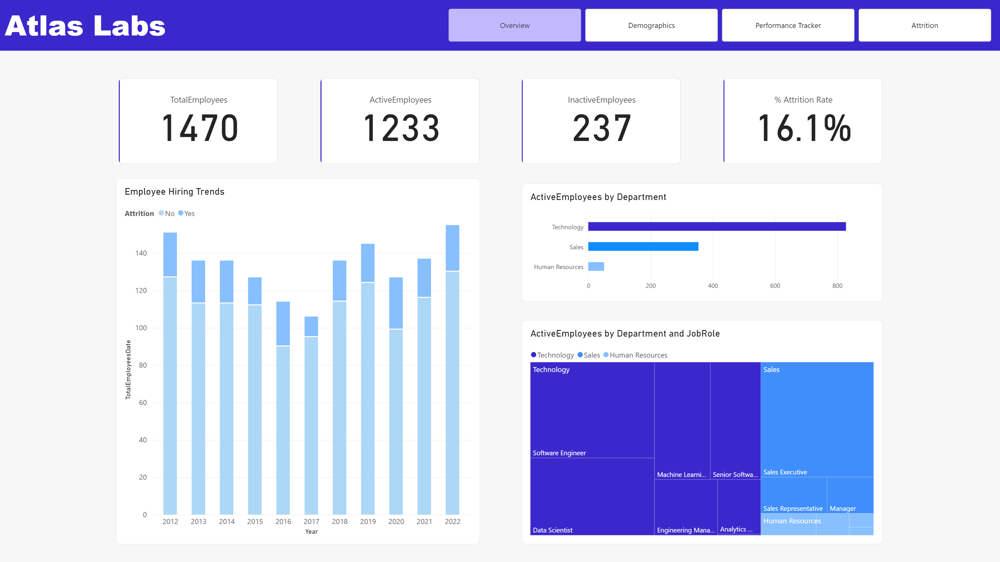
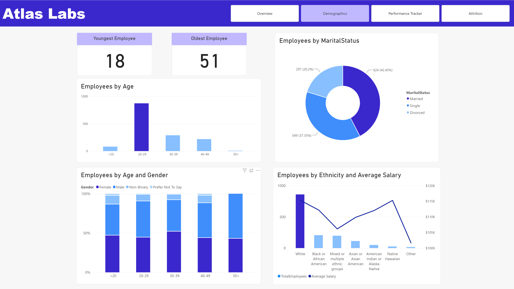
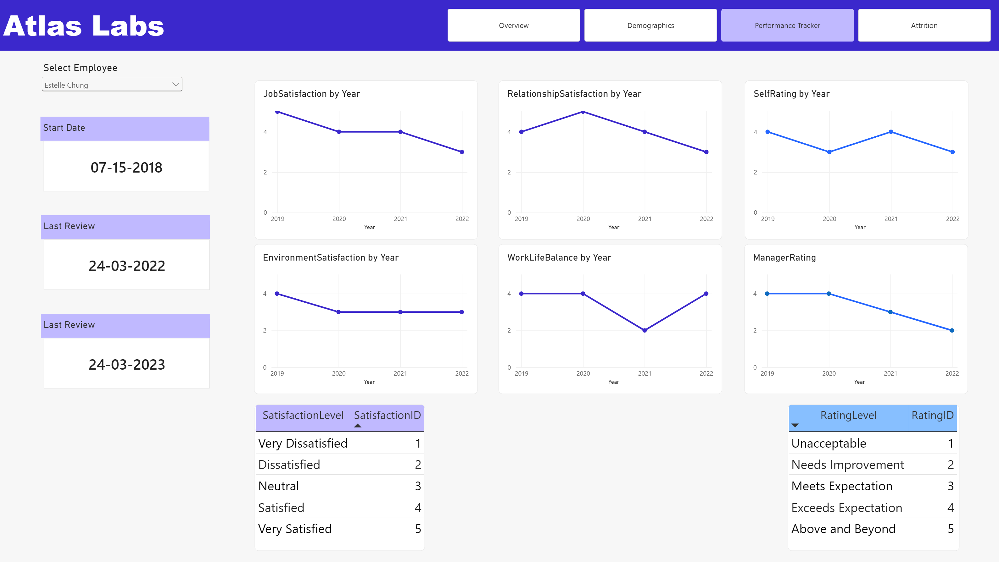
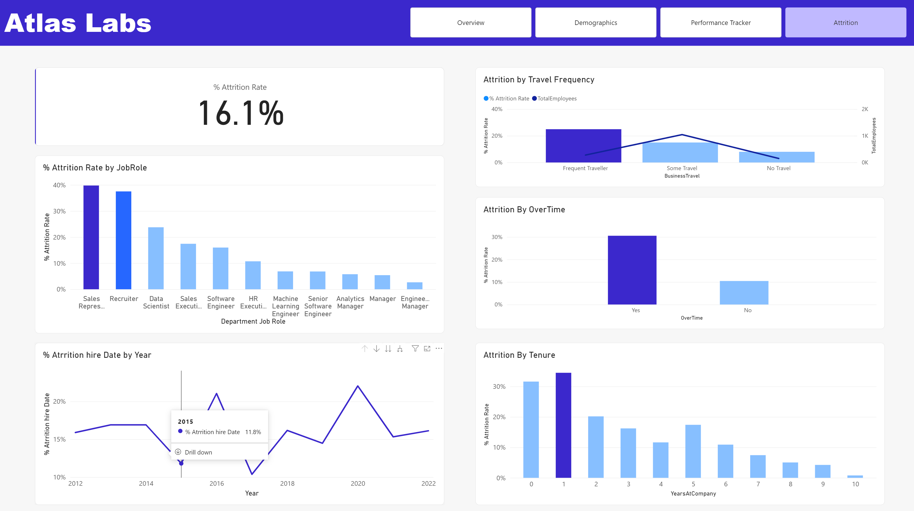
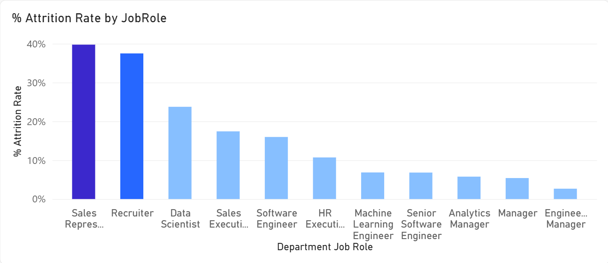
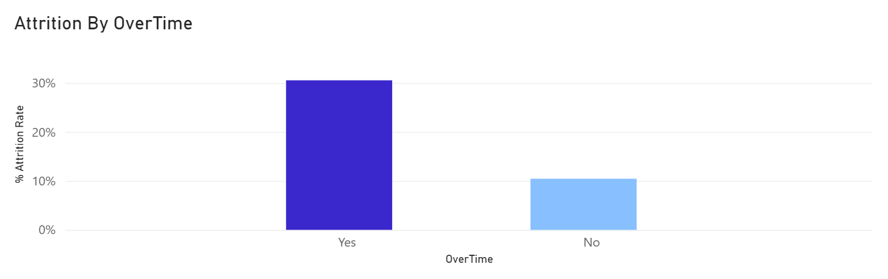
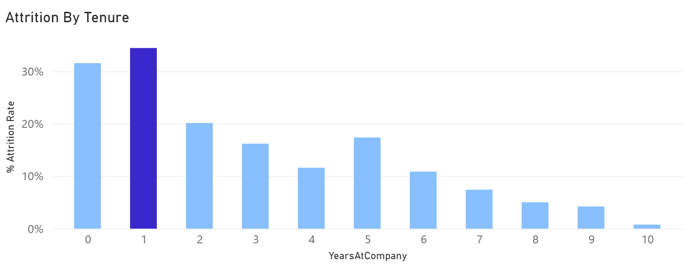
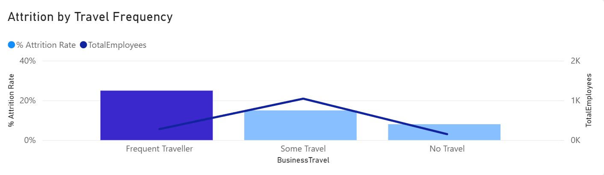

# Atlas Labs: HR Analytics Dashboard

**Why is Atlas Labs losing 1 in 6 employees a year, and can the data tell us who's next?**

That's the question this Power BI dashboard was built to answer.

---

## Quick Look (30 second read)

**The problem:** Atlas Labs had a 16.1% attrition rate and no way to see where it was coming from.

**What I did:** Modeled the HR data in Power BI, built out attrition and performance measures in DAX, and designed a 4 page interactive report covering company overview, workforce demographics, individual performance tracking, and attrition drivers.

**What I found:** Attrition wasn't random. It was concentrated in specific roles, tied heavily to overtime, and heaviest in an employee's 0-1 year, 31.6% in year zero and 34.5% in year one.

**What I recommended:** Stop treating retention as a company wide problem and start treating it as a handful of targeted ones, fix overtime load first, fix onboarding for the first two years second.

Curious how I got there? Keep scrolling.

---

## Table of Contents
1. [The Problem](#the-problem)
2. [How I Approached It](#how-i-approached-it)
3. [Walking Through the Dashboard](#walking-through-the-dashboard)
4. [What the Data Showed](#what-the-data-showed)
5. [What Should Happen Next](#what-should-happen-next)
6. [Tech Stack](#tech-stack)

---

## The Problem

Atlas Labs knew one number: attrition was rising. That's it. HR couldn't say which departments were hit hardest, whether overtime or travel was pushing people out, or whether new hires or veterans were more likely to leave. Every retention effort was a guess dressed up as a policy.

The goal was simple to state and harder to build: turn scattered HR data into a dashboard that shows not just how many people are leaving, but why.

---

## How I Approached It

I modeled the data as a snowflake schema in Power BI. `FactPerformanceRating` sits at the center as the fact table, surrounded by dimension tables like `DimEmployee` and `DimDate`. Some of those dimensions branch out even further into sub dimensions, education level splits off from `DimEmployee`, and satisfaction and rating scores get their own lookup tables instead of sitting around as raw numbers. That extra layer of branching is what makes it a snowflake schema instead of a simple star, and it kept everything easy to trace as the model grew.

From there:
- Cleaned and shaped the data in **Power Query**
- Built relationships connecting employees, dates, and performance records
- Wrote **DAX** measures for attrition rate and rate breakdowns by role, tenure, overtime, and travel
- Designed four report pages, each answering a different layer of the question

---

## Walking Through the Dashboard

**Overview**
The starting point. 1,470 total employees, 1,233 active, 237 gone, for that 16.1% attrition rate. Technology is by far the biggest department, Sales next, HR a small team by comparison.

**Demographics**
Who makes up the workforce. Ages run 18 to 51, skewing young, with 20 to 29 year olds far outnumbering every other age band. Roughly 42% married, 37% single, 21% divorced.

**Performance Tracker**
A per employee view of satisfaction and manager ratings from 2019 to 2022. Several of these lines drift downward over time, worth a second look on its own.

**Attrition**
The core of the story. Attrition sliced by job role, overtime status, travel frequency, and tenure, and this is where the real patterns show up.

---

## What the Data Showed

### 1. A handful of roles are doing most of the damage

Sales Representatives and Recruiters leave at close to 4 to 7 times the rate of Engineering Managers. Attrition here isn't a company wide illness, it's a few roles bleeding out.

### 2. Overtime is the loudest signal in the data

Employees working overtime leave at almost 3 times the rate of those who don't. Bigger effect than most demographic factors combined.

### 3. Year zero and year one are the danger zone

Attrition is highest in the first two years, 31.6% at year zero and 34.5% at year one, then drops steadily after. This points to onboarding and early role fit, not long term burnout.

### 4. Frequent travel quietly pushes people out

Frequent travellers show noticeably higher attrition despite being a smaller slice of the workforce. An easy factor to overlook.

### 5. Engagement is sliding, not staying flat

Job satisfaction, environment satisfaction, and manager ratings trend downward from 2019 to 2022. Combined with the attrition numbers, this looks like a growing risk, not a stable one.

---

## What Should Happen Next

1. **Focus on Sales Representatives and Recruiters first.** These roles lose the most people, so retention money should go here before anywhere else.
2. **Investigate overtime load** in the highest attrition roles. This is likely a bigger lever than a pay raise.
3. **Rebuild the first 90 days.** Structured check ins and clear expectations early on, since that's when people are walking out the door.
4. **Rethink travel demands** for roles that require frequent travel. Caps, comp adjustments, or hybrid options where possible.
5. **Dig into why satisfaction is dropping** year over year before it drives attrition even higher.
6. **Check if pay is fair across different groups.** across demographic groups using the demographics data as a starting point.
7. **Refresh this dashboard monthly** so HR can see if any of this actually moves the needle.

---

## Tech Stack
Power BI Desktop, Power Query, DAX, Snowflake schema data modeling

---

